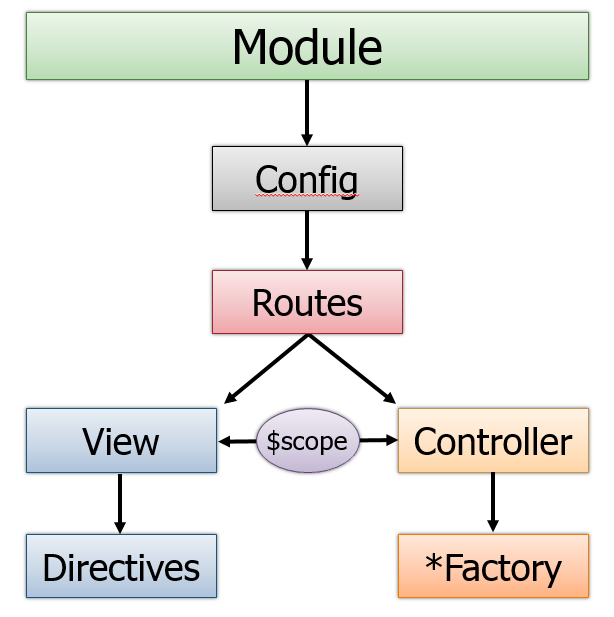
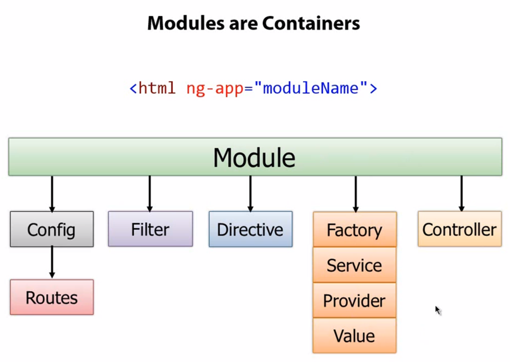

# Web App 社團 AngularJs 分享會

## 大綱

 

* 簡介 AngularJs (利用 [angular-express-ejs-seed](https://github.com/maru0923/angular-express-ejs-seed) )

	- controller
	
		* [controller 的五種寫法](http://blog.miniasp.com/post/2013/07/23/AngularJS-five-ways-to-register-ngController.aspx)
		* ng-app
		* ng-model
		* ng-init
		* ng-click		
		* ng-repeat
		* ng-show, ng-hide
		* ng-class
		* ng-src
		* ng-option [ngOption 參數用法](http://blog.miniasp.com/post/2013/05/12/AngularJS-ng-module-select-ngOptions-usage-samples.aspx)
		* $scope, $rootScope

	- filter
		* json
		* limitTo
		* orderBy
		* filter
				
	- module
		  

		
	- router
		* ng-view
		
	- directive
		* $scope, scope
	
	- service

* Angular UI 介紹
	
	- UI Bootstrap
	- UI Router
		* ui-view

* Require.js 介紹

* 分享 Dcard 改版心得
	- angular part
	- s3 	cloudfront
	- express-cdn

* 犯過的 bug or 小心得
	- __為什麼每次 controller 都執行兩次？__ 因為引入兩次
	- 權限認證怎麼辦? [參考文章](https://github.com/witoldsz/angular-http-auth) 

## 相關資源

### 教學
- [Egghead.io](http://www.egghead.io/) __推!!__
- [Thinkster - A better way to learn AngularJS.](http://www.thinkster.io/)

### 文章
- [AngularJS 開發 ASP.NET MVC -twMVC#9](https://speakerdeck.com/twmvc/angularjs-kai-fa-asp-dot-net-mvc-twmvc-number-9)

### 社群
- [Angular.tw](http://www.facebook.com/groups/augularjs.tw)
- [angularjs.cn](http://angularjs.cn/)

###[更多資源](https://github.com/jmcunningham/AngularJS-Learning)

